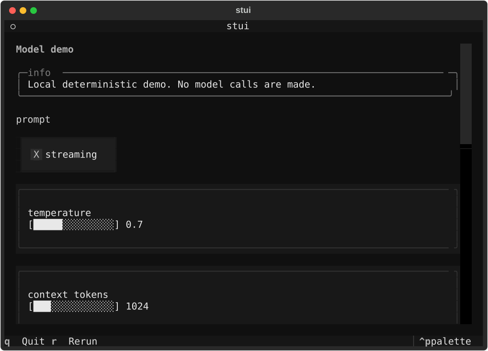

# stui

[](https://github.com/marmar9615-cloud/stui-terminal/actions/workflows/ci.yml)

`stui` is a tiny Streamlit-inspired framework for building terminal-native
Python apps. Write a short script, run it in your terminal, and get a Textual UI
with stateful controls.

It is built for local tools, demos, data scripts, model debug panels, SSH
sessions, and headless environments where opening a browser, binding a port, or
running a dashboard server is unnecessary ceremony. The public API is
deliberately small and readable.

`stui` is not official Streamlit, is not affiliated with Streamlit, and is not a
Streamlit compatibility layer. The API intentionally feels familiar, but this
project keeps its own smaller surface area.

## Preview



```text
┌─ stui ───────────────────────────────────────────┐
│ stui demo                                        │
│                                                  │
│ x                                                │
│ [██░░░░░░░░░░░░] 10                              │
│                                                  │
│ [ Increment ]                                    │
│                                                  │
│ x = 10                                           │
│ count = 0                                        │
│                                                  │
│ q Quit   r Rerun   tab Focus next                │
└──────────────────────────────────────────────────┘
```

## Install

Use Python 3.11 or newer.

Install the PyPI distribution named `stui-terminal`:

```bash
python3.11 -m pip install stui-terminal
```

The PyPI distribution name is `stui-terminal`, but the import package and CLI
are both `stui`:

```python
import stui as st
```

For local development from a checkout, use an editable install with the dev
extra:

```bash
python3.11 -m venv .venv
. .venv/bin/activate
python3.11 -m pip install -e ".[dev]"
```

For runtime-only local use, install without the dev extra:

```bash
python3.11 -m pip install -e .
```

## Quickstart

Install from PyPI, then run your app:

```bash
python3.11 -m pip install stui-terminal
stui run app.py
```

Or set up the project from source and run the basic example:

```bash
git clone https://github.com/marmar9615-cloud/stui-terminal.git
cd stui-terminal
python3.11 -m venv .venv
. .venv/bin/activate
python3.11 -m pip install -e ".[dev]"
stui run examples/basic.py
```

You can also run through the module entry point:

```bash
python3.11 -m stui run examples/counter.py
```

Scripts use the public `stui` API:

```python
import stui as st

st.title("stui demo")

if "count" not in st.session_state:
    st.session_state.count = 0

value = st.slider("value", 0, 100, 25)

if st.button("Increment"):
    st.session_state.count += 1

st.write("value =", value)
st.write("count =", st.session_state.count)
```

More examples:

```bash
stui run examples/counter.py
stui run examples/model_demo.py
stui run examples/inputs.py
stui run examples/data_display.py
stui run examples/dashboard.py
```

## Why terminal-native?

Some useful Python apps do not need a browser runtime. `stui` keeps the
interface inside the terminal so it can fit naturally into:

- SSH sessions, remote machines, and headless boxes.
- Internal tools where opening ports or managing local server URLs is friction.
- Offline or locked-down environments where browser access is limited.
- Model, data, and DevOps workflows that already start from a shell.

That also keeps the boundary simple: `stui` does not start a web server, use
websockets, require port-forwarding, or depend on Streamlit at runtime.

## Commands

```bash
# Install the project for local development.
python3.11 -m venv .venv
. .venv/bin/activate
python3.11 -m pip install -e ".[dev]"

# Run the smoke-size example app.
stui run examples/basic.py

# Run the stateful counter example.
stui run examples/counter.py

# Run the deterministic model-parameter demo.
stui run examples/model_demo.py

# List installed examples and print environment diagnostics.
stui examples
stui doctor

# Run the test suite.
python3.11 -m pytest
```

## Keyboard Shortcuts

- `q`: quit the app
- `r`: rerun the script
- `tab`: focus the next widget
- `enter`: press the focused button
- `left` or `h`: decrease the focused slider
- `right` or `l`: increase the focused slider
- `home`: set the focused slider to its minimum value
- `end`: set the focused slider to its maximum value

## Current API

The current public API is intentionally small:

- `st.title(body, *, key=None)`: render a title.
- `st.header(body, *, key=None)`: render a section header.
- `st.subheader(body, *, key=None)`: render a smaller section header.
- `st.caption(body)`: render muted explanatory text.
- `st.text(body)`: render plain text.
- `st.markdown(body)`: render Markdown-flavored text.
- `st.code(body, language=None)`: render a syntax-highlighted code block.
- `st.json(obj)`: pretty-print JSON-serializable objects.
- `st.exception(exc)`: render an exception traceback panel.
- `st.progress(value, text=None)`: render progress from `0..100` or `0.0..1.0`.
- `st.divider()`: render a horizontal divider.
- `st.info(body)`, `st.success(body)`, `st.warning(body)`, `st.error(body)`: render status messages.
- `st.table(data)`: render simple tabular data without requiring pandas.
- `st.dataframe(data)`: alias for `st.table(data)` in this MVP.
- `st.write(*args)`: render simple text output.
- `st.button(label, key=None, help=None, disabled=False, on_click=None, args=None, kwargs=None)`: render a button and return `True` for the run where it was pressed.
- `st.slider(label, min_value=0, max_value=100, value=None, step=1, *, key=None, help=None, disabled=False, on_change=None, args=None, kwargs=None)`: render a numeric slider and return its current value.
- `st.text_input(label, value="", *, key=None, placeholder=None, disabled=False, on_change=None, args=None, kwargs=None)`: render a single-line text input and return its current value.
- `st.checkbox(label, value=False, *, key=None, disabled=False, on_change=None, args=None, kwargs=None)`: render a checkbox and return its current value.
- `st.number_input(label, min_value=None, max_value=None, value=0, step=1, *, key=None, disabled=False, on_change=None, args=None, kwargs=None)`: render a numeric input.
- `st.selectbox(label, options, index=0, *, key=None, disabled=False, on_change=None, args=None, kwargs=None)`: choose one option from a dropdown.
- `st.radio(label, options, index=0, *, key=None, disabled=False, on_change=None, args=None, kwargs=None)`: choose one option from a radio group.
- `st.session_state`: persist values across reruns with dict-style or attribute-style access.
- `st.rerun()`: request a script rerun.

Import the API as:

```python
import stui as st
```

## Examples

### Counter

`examples/counter.py` shows a minimal stateful app with increment, decrement, and
reset controls.

```bash
stui run examples/counter.py
```

### Model Demo

`examples/model_demo.py` shows a small model-parameter playground using text
input, checkbox, sliders, status messages, session state, and deterministic
scoring. It is intentionally local and fake: there are no network calls or model
dependencies.

```bash
stui run examples/model_demo.py
```

### Inputs

`examples/inputs.py` shows text, numeric, selectbox, radio, checkbox, and button
controls together.

```bash
stui run examples/inputs.py
```

### Data Display

`examples/data_display.py` shows tables, JSON, and code output.

```bash
stui run examples/data_display.py
```

### Dashboard

`examples/dashboard.py` combines controls, progress, status messages, and a
small table into a compact terminal control panel.

```bash
stui run examples/dashboard.py
```

## Limitations

- No browser, web server, websocket, or port-forwarding runtime.
- No Streamlit dependency and no promise of Streamlit compatibility.
- No charts, forms, columns, sidebars, or file upload yet.
- Tables are static display only; there is no full dataframe editing or sorting.
- Slider input supports numeric values only.
- Layout is currently linear and script-driven.
- The app reruns the script as interactions change state, so examples should keep top-level work lightweight.
- Error handling is still early and meant for development feedback.
- The package is an MVP and has not stabilized a long-term compatibility policy.

## Roadmap

- Add charts and richer dataframe display.
- Add simple form-like batching once rerun semantics are clearer.
- Improve focus behavior, accessibility hints, and keyboard discoverability.
- Expand example coverage for data scripts, model controls, DevOps panels, and internal tools.
- Keep the implementation clean-room, readable, and based on Textual first-party widgets where possible.

## Contributing

See [CONTRIBUTING.md](CONTRIBUTING.md) for the local development workflow and
project boundaries.
