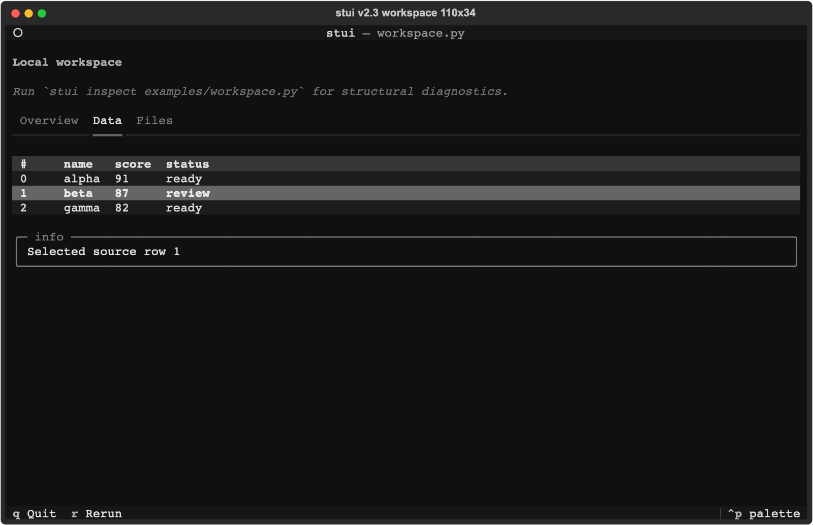
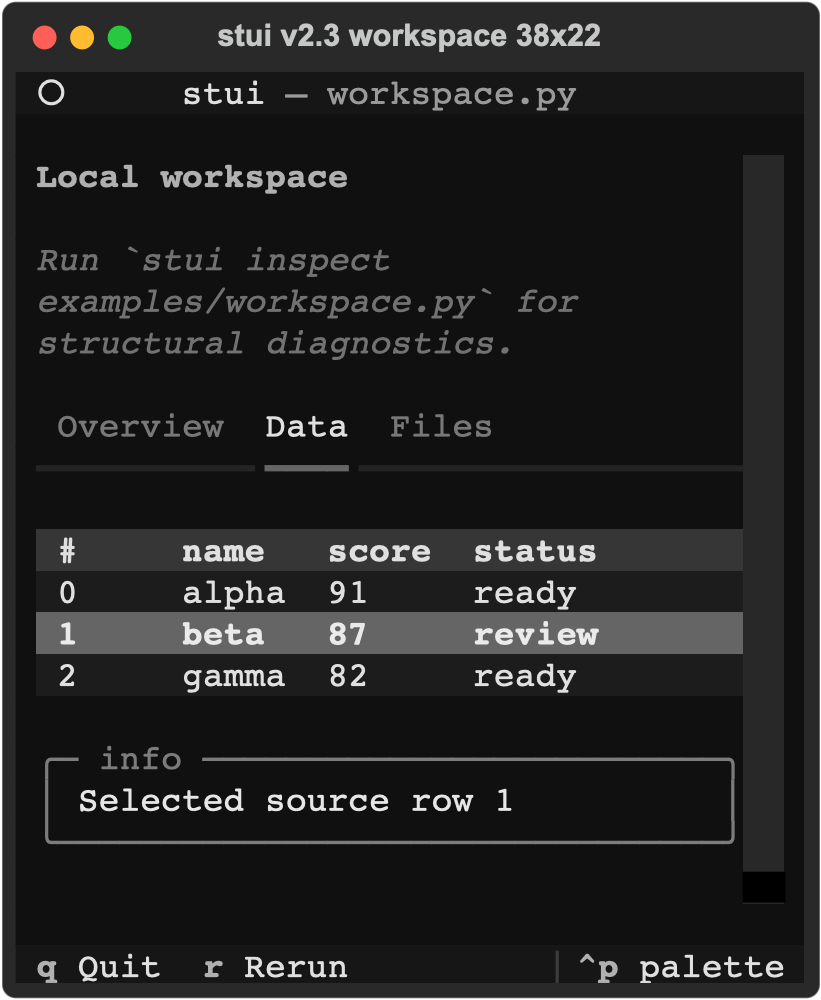
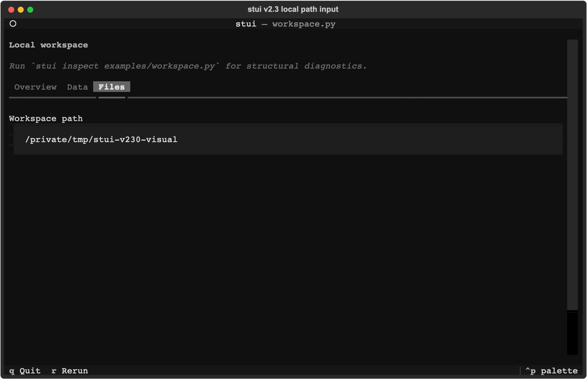
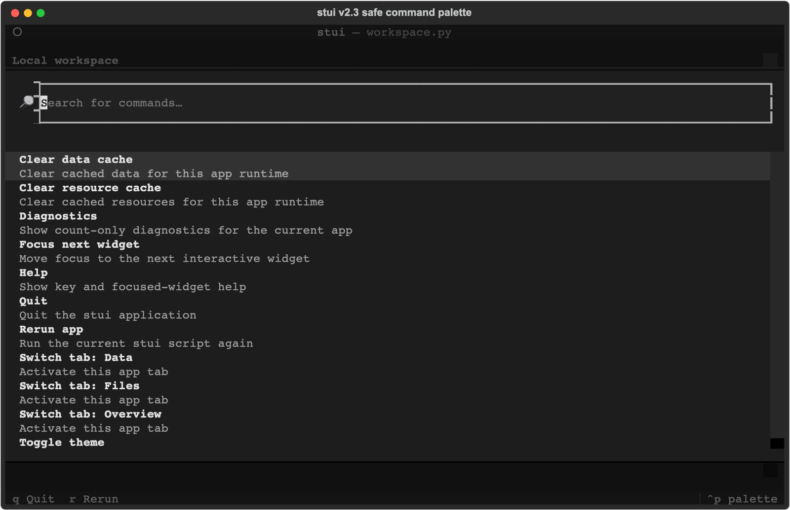

# Live Terminal Visual Proof

The images on the README and PyPI page are captures from the real Textual app,
not mockups or redrawn terminal art. They use the bundled
`examples/workspace.py` demo and stui's normal runtime.

## What Was Exercised

- `st.tabs`: moved from Overview to Data and Files with the arrow keys.
- `st.data_table`: moved the row cursor and selected source row 1 with Enter.
- `st.path_input`: rendered its normalized local path from a temporary app copy.
- Command palette: opened with Ctrl+P and rendered only the fixed built-in
  actions, including visible-tab switching and count-only diagnostics.
- Narrow layout: repeated the tab and row-selection flow at 38 by 22 cells.

The wide and narrow captures both selected the Data tab and source row 1. The
path capture ran from `/tmp/stui-v230-visual` so it contains no user-home path.

## Captures

### Stateful tabs and selectable data



### Narrow terminal



### Local path input



### Safe command palette



## Reproduce It

Install the package or use an editable checkout, then launch the same demo:

```bash
python -m pip install stui-terminal
stui demo workspace
```

Use Left/Right on the tab bar, arrow keys plus Enter in the table, and Ctrl+P
for the command palette. Press `q` to quit.

For automated interaction proof, run:

```bash
python3.11 -m pytest \
  tests/test_tabs.py \
  tests/test_data_table.py \
  tests/test_path_input.py \
  tests/test_command_palette.py
python3.11 scripts/verify_v230_project.py \
  --wheel dist/stui_terminal-2.3.0-py3-none-any.whl
```

The external-project validator performs real headless Textual interactions and
reports the active tab, selected source row, helper reload, cache counts, and
session-state run count as structured evidence.
